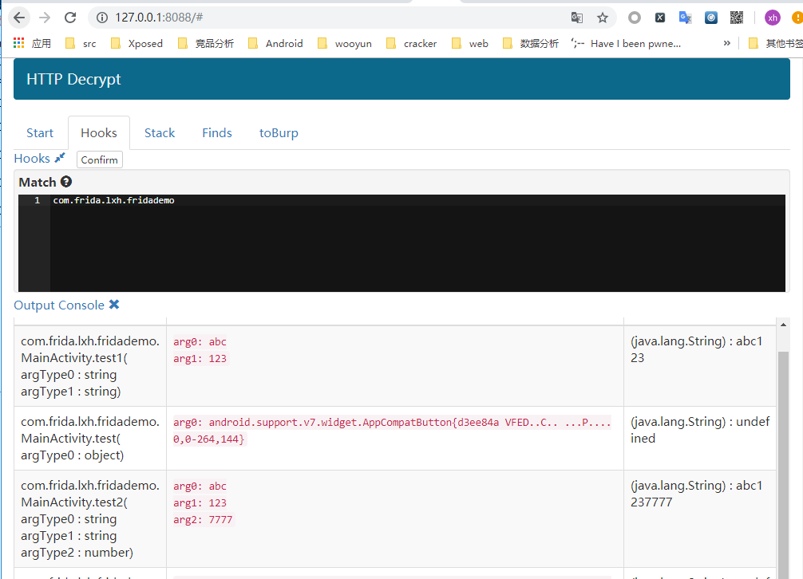
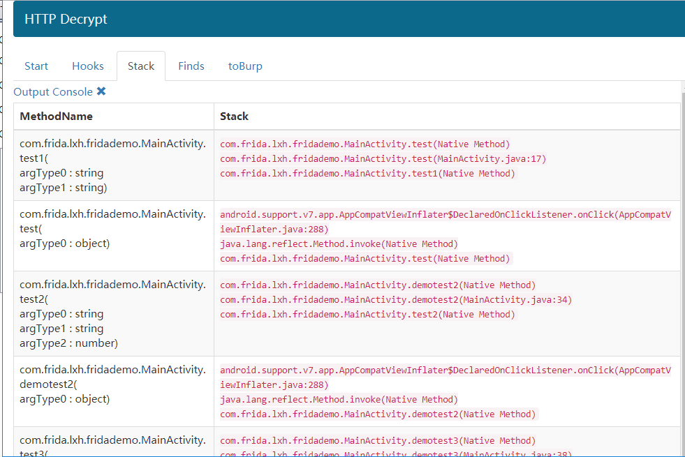
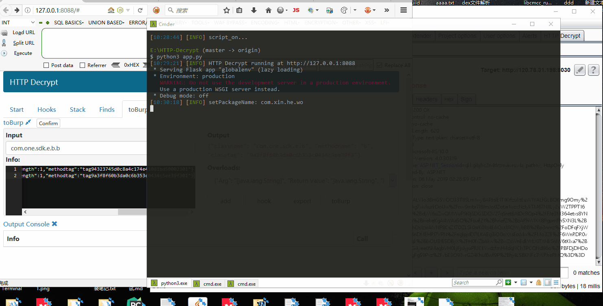
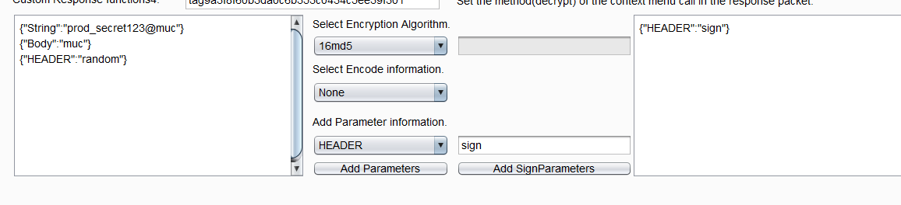
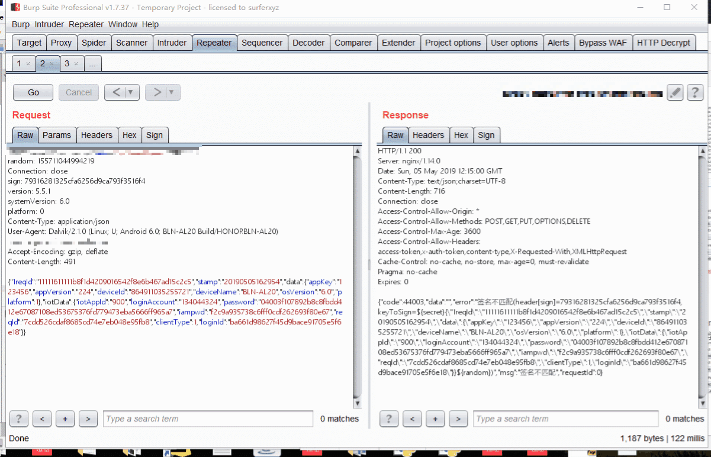
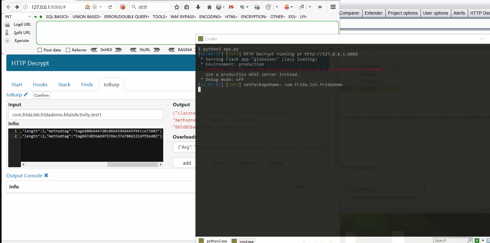

# HTTP Decrypt

利用HTTP协议 远程加解密数据包，实现Burp一条龙服务。

## 背景
在做APP渗透测试的时候，通常通信协议基本都做了加解密功能，每次都需要去逆向APP并寻找到加解密算法后，针对写Burp插件，这么一个流程下来花费了一大堆的时间，万一遇到加固，又要耗时间去脱壳，这尼玛遇到壳又脱不了，咋怎，最后利用几分钟来抓包改包，然后发现0高0中0低...我枯了，你们呢。

HTTP Decrypt 提供了Finds Hooks模块，可以在不逆向不脱壳的情况下快速的找到APP所使用的加解密算法，而toBurp模块提供了直接使用APP内的方法进行加解密，而不需自己动手敲代码，对于整体POST加密更是提供了自动化加解密功能，可以实现Burp一条龙，Burp Scanner ，Intruder自动加解密。


### env base:
python3
感谢python3 世界上最好的语言

frida
感谢frida  世界上最牛逼的逆向框架

Burp
感谢BurpSuite 世界上最牛逼的Web测试工具

flask
感谢flask 世界上最轻量级的web应用框架


## 使用方式

**运行**


不指定端口直接运行则为默认端口，

1. python3 app.py
2. Android_frida_server 运行
3. 转发frida端口。 
4. 打开HTTP Decrypt页面，如果在Start界面出现应用包名列表信息则可正常使用其他功能，如果不行，刷新一下看看控制台出现的信息。


### Hooks
填写字符串，将类名与你填写的字符串匹配，并Hooks类下的所有方法，hook多个类名，回车换行。


### Stack
Hooks打印的堆栈会在这里显示。


### Finds
根据字符串，查找类，匹配到类，将类下的方法都打印出来。多个查找回车换行继续写。提供了过滤机制。


### toBurp

#### 对称加解密

通过xxx方式得到了通信协议加解密函数。如下例子中的：
```
com.one.sdk.e.b.a   encrypt
com.one.sdk.e.b.b   decrypt 
```


选择完成后，点击Export。


效果：


在可编辑区域调用的是Request function 1,2，不可编辑区域调用的是response function3 ,4

打开Auto后，Burp Scanner ，Intruder模块 也可以使用。
Auto功能 数据包加密调用的是 Request function 1，数据包解密调用的Request function 2，因此想要使用Auto功能，需要正确填写加解密函数位置，不要填反了。

#### 签名


某APP数字签名算法如下：
字符串  "prod_secret123@muc" +整个 body + HTTP头 random字段;
签名值放在HTTP头中的sign字段。使用md532位加密，配置如下。


效果：



### toBurp-hook (配合export使用)
调用APP内的方法

hook之后会有call按钮，如果想使用，请点击export按钮之后再使用。
效果如下：


Note:也可以直接在POST修改，但是需要解码一次，比较麻烦，因此直接选择Change body encoding,然后进行修改，效果一样的。

### toBurp-toBurp
拦截指定函数，修改参数or返回值，再返回给应用程序。
复杂数据类型仅支持修改一维数组。



### future
1. 支持IOS，（老板说配IOS测试机 配了几个月了 还没到手。）
2. 支持Native
3. toBurp-toBurp 增加栈。
4. 还没想好。


### 申明
本项目只可用于安全研究，禁止进行未授权攻击行为。
我们严格禁止一切通过本程序进行的违反任何国家法律行为，请在合法范围内使用本程序。
使用本程序则默认视为你同意我们的规则，请您务必遵守道德与法律准则。
如不遵守，后果自负，开发者将不承担任何责任！