## Home
填写与应用程序名称对应的标识符。
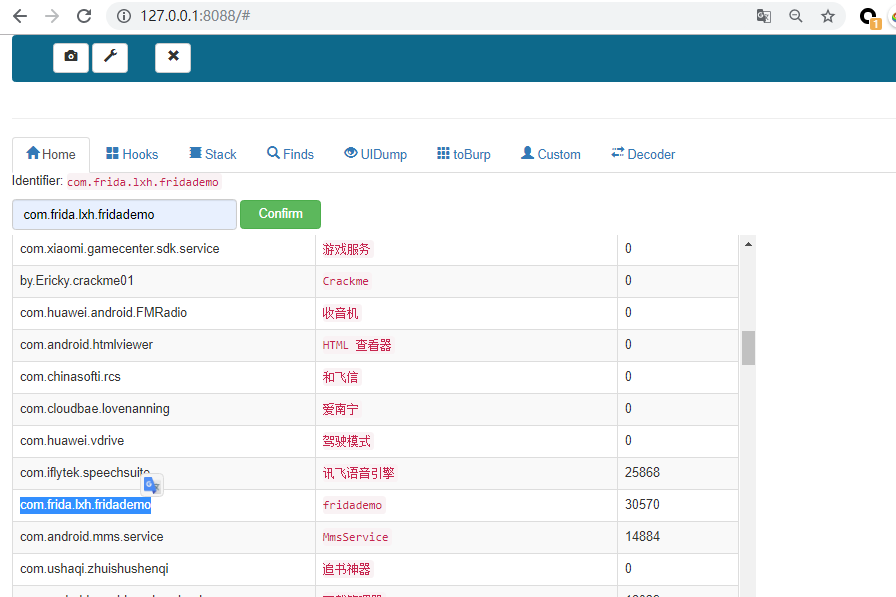

## Hooks
填写的字符串，会与所有已加载的类名进行匹配，如果匹配上了则hook该类下的所有方法。多个字符串，换行填写,增加过滤功能。
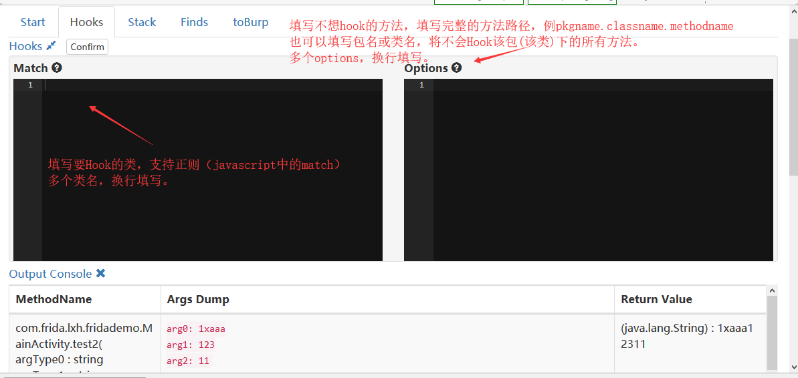

## Stack
Hooks打印的堆栈会在这里显示。


## Finds
填写的字符串，会与所有已加载的类名进行匹配，如果匹配上了则打印该类下的所有方法，为空则将Android已经加载了的所有类打印出来。
提供了过滤机制。

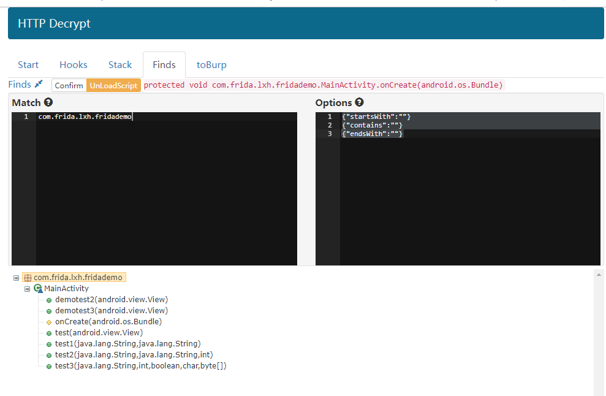

## Searchmethods
根据填写的字符串搜索匹配的方法，支持正则，多个换行填写。
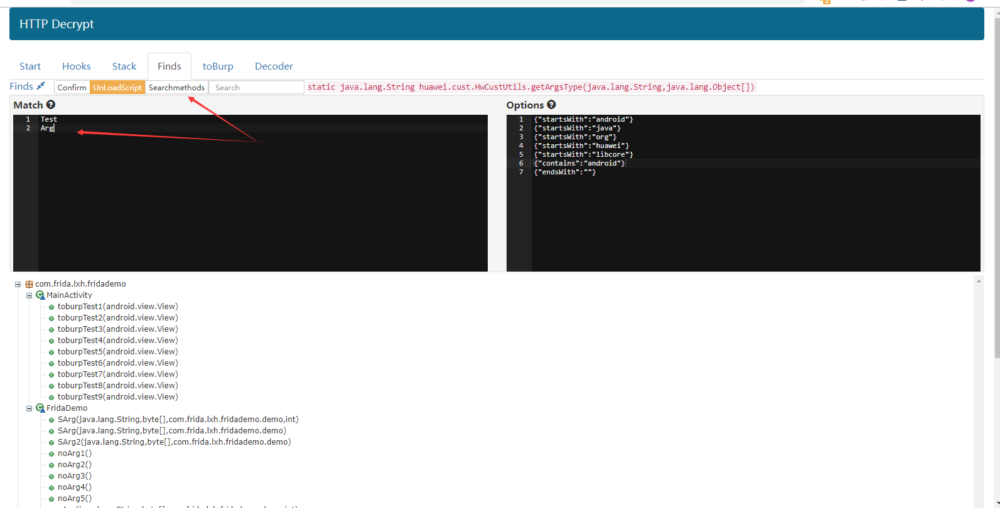

## search
在打印出来的信息里面查找包含Util的字符串，查找不区分大小写。
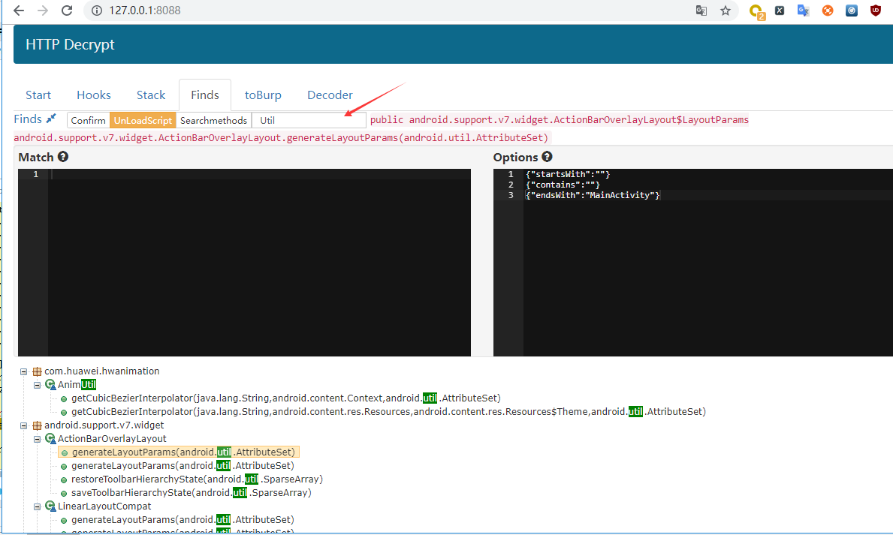

## UIDump
监控界面变化。
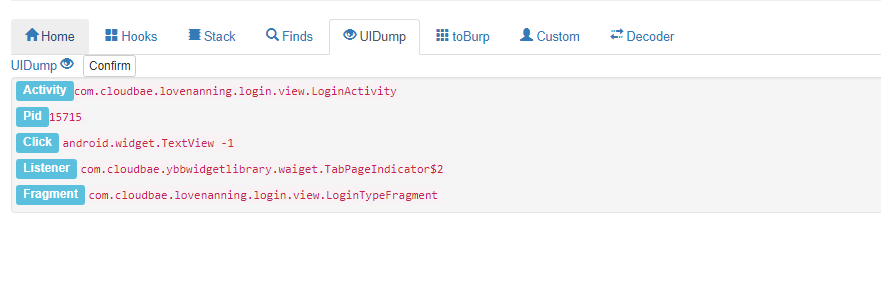

## toBurp

### 对称加解密

通过xxx方式得到了通信协议加解密函数。如下例子中的：
```
com.one.sdk.e.b.a   encrypt
com.one.sdk.e.b.b   decrypt 
```
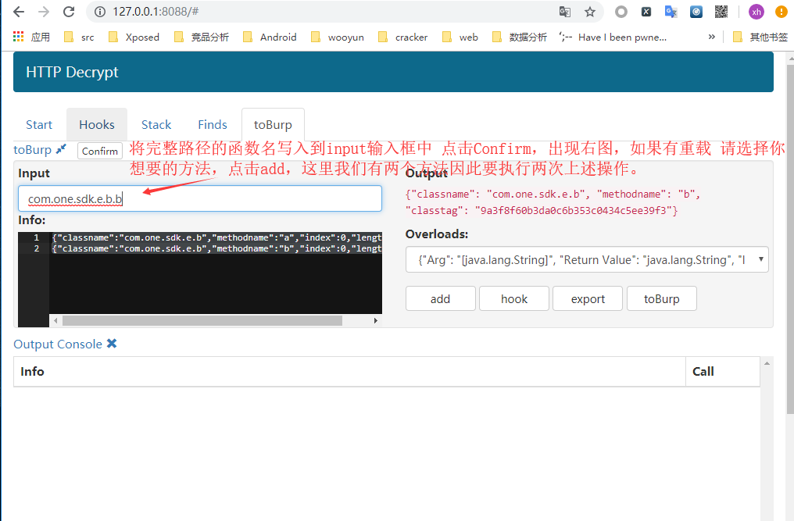

选择完成后，点击Export。
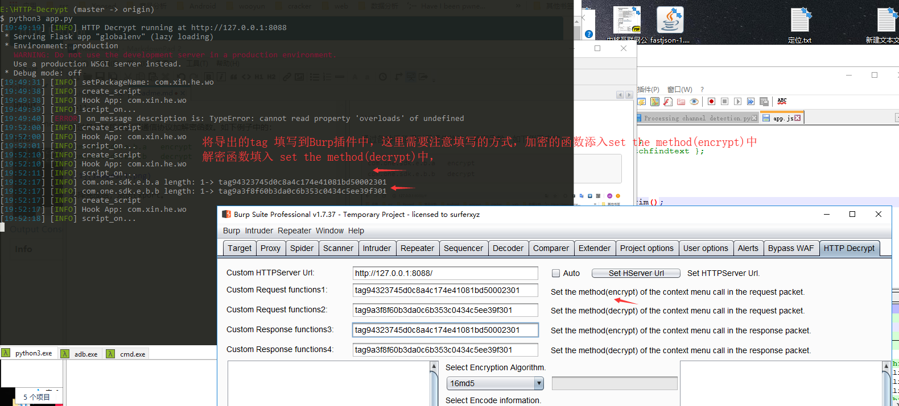

效果：
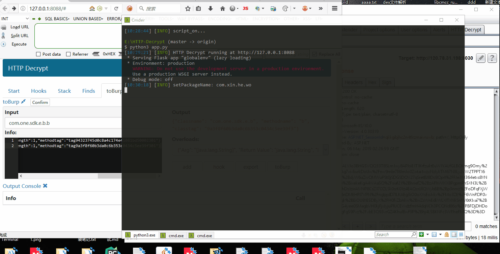

在可编辑区域调用的是Request function 1,2，不可编辑区域调用的是response function3 ,4

打开Auto后，Burp Scanner ，Intruder模块 也可以使用。
Auto功能 数据包加密调用的是 Request function 1，数据包解密调用的Request function 2，因此想要使用Auto功能，需要正确填写加解密函数位置，不要填反了。

### 签名
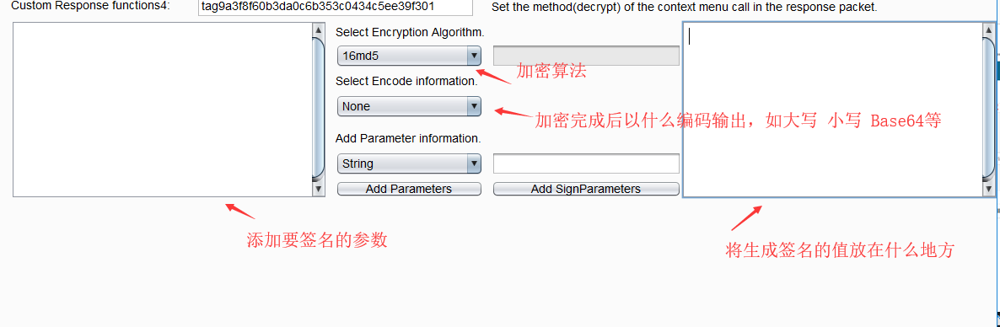

某APP数字签名算法如下：
字符串  "prod_secret123@muc" +整个 body + HTTP头 random字段;
签名值放在HTTP头中的sign字段。使用md532位加密，配置如下。


效果：


## toBurp-hook (配合export使用)
调用APP内的方法

hook之后会有call按钮，如果想使用，请点击export按钮之后再使用。
效果如下：
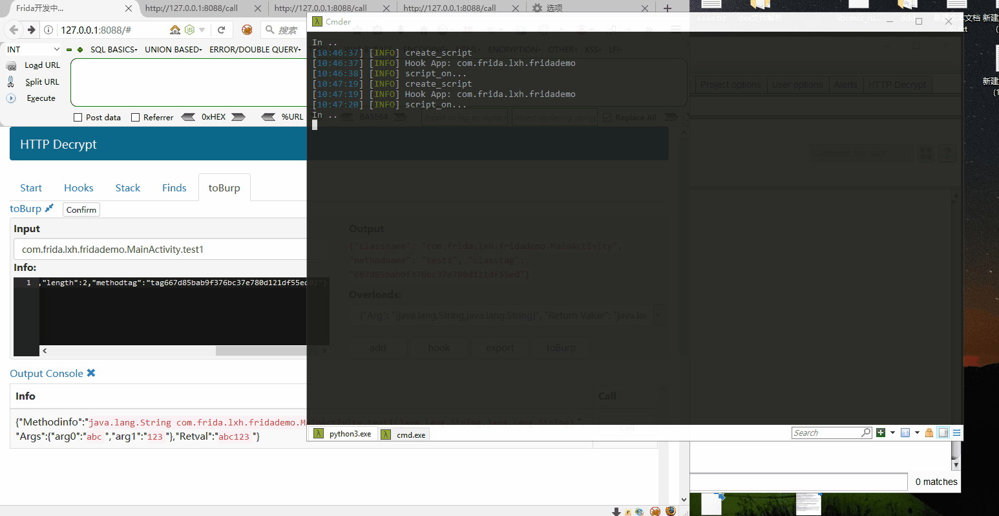

Note:也可以直接在POST修改，但是需要解码一次，比较麻烦，因此直接选择Change body encoding,然后进行修改，效果一样的。

## toBurp-toBurp
拦截指定函数，修改参数or返回值，再返回给应用程序。
复杂数据类型仅支持修改一维数组。
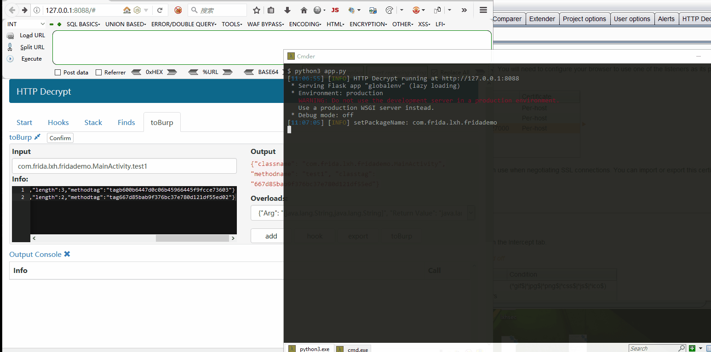

## Decoder
新增Decoder功能，支持byte[] 与字符串相互转换，byte[] 与十六进制字符串相互转换。
在Hooks的时候，会打印byte[]参数，如果我们想看byte参数的字符串内容，或者看AES/DES等加密算法的Key(Key与iV都是以数组形式打印出来，将其转换成16进制字符串就是代码中填写的值)，就可以使用这个功能。
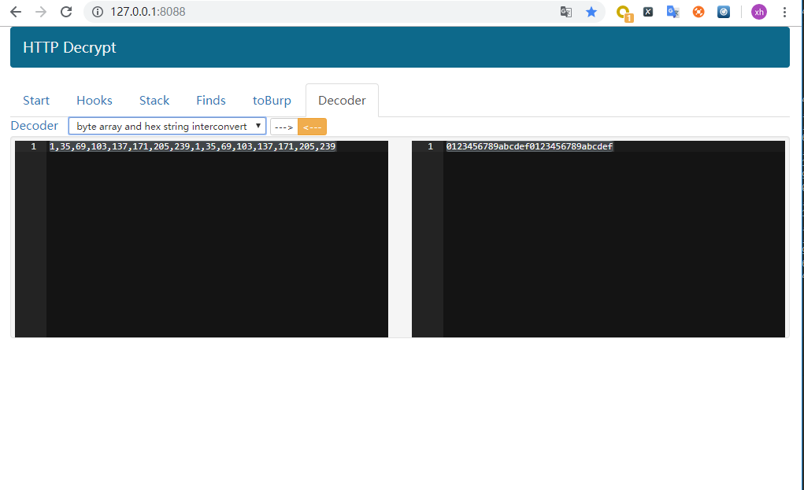

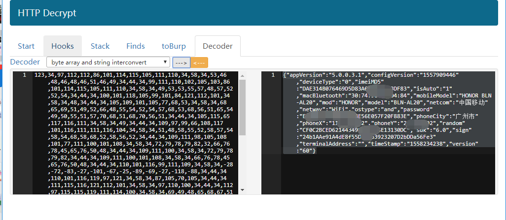

Note：如果转换后是乱码，一般都是加密算法(AES等)加密之后的结果。
