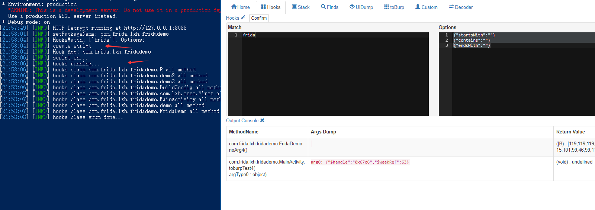
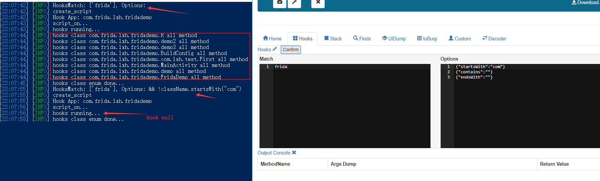
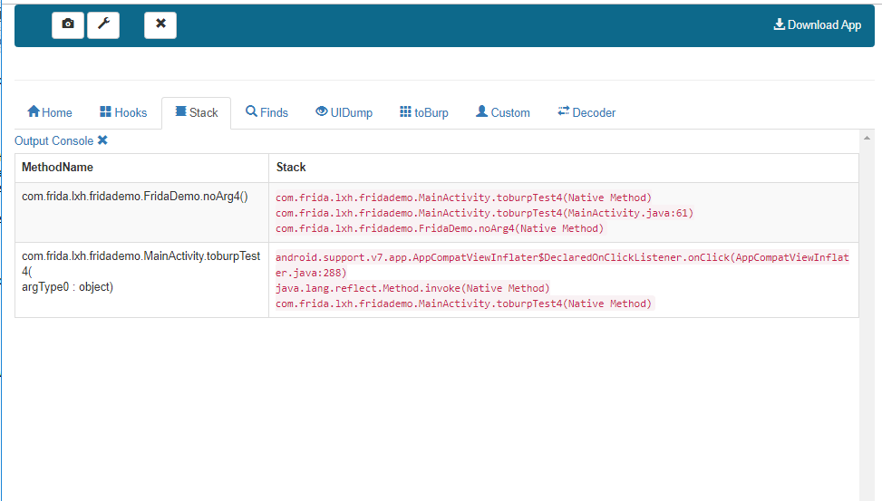
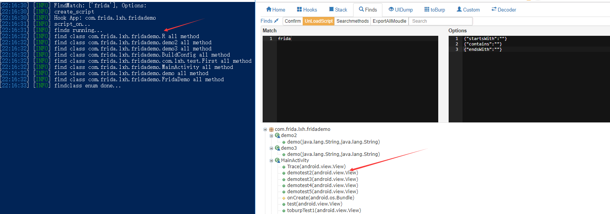
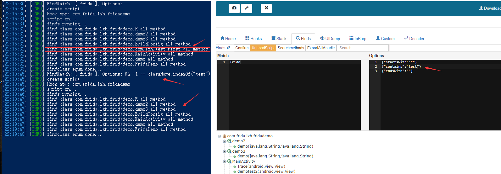
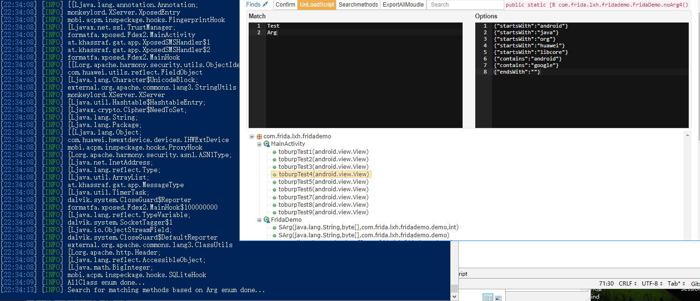
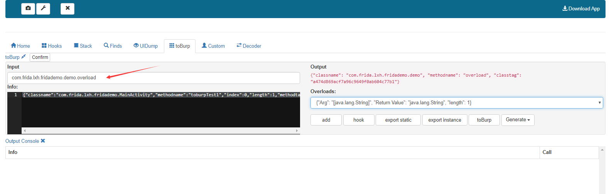

## Home
Fill in the identifier corresponding to the application name.

## Hooks
Traverse all the class names of the App, match the filled string(Support for regular), meet the conditions, then **hook** all methods under the class.

match is empty,hook all classes.

Options: 
Filter the hook class name, and if it matches, do not hook the matching class

## Stack
The Hooks printed stack is shown here.

## Finds
Traverse all the class names of the App, match the filled string(Support for regular), meet the conditions, then **print** all methods under the class.

Options: 
Filter the finds class name, and if it matches, do not print the matching class

### Searchmethod
Search for matching methods based on the filled string(Support for regular).

### search
Find the string containing Util in the printed information, which is case-insensitive.

## UIDump
Monitor Activity.

## toBurp
PakageName.ClassName.MethodName

export static: rpc static method.
export instance: rpc instance method.

hook-call:
Execute the APP method

With the Burp plugin, automatic encryption and decryption of packets can be achieved. 

Notice:**When using Body Auto, the tag used when the request package is automatically encrypted is req fun1. When the package is returned for decryption, the tag used is req fun2**

### toBurp-toBurp
Intercepts the specified function, modifies the or return value, and returns it to the application.

Complex data types only support modifying one-dimensional arrays.

## Decoder
Support byte[] and string conversion, byte[] and hexadecimal string conversion.

