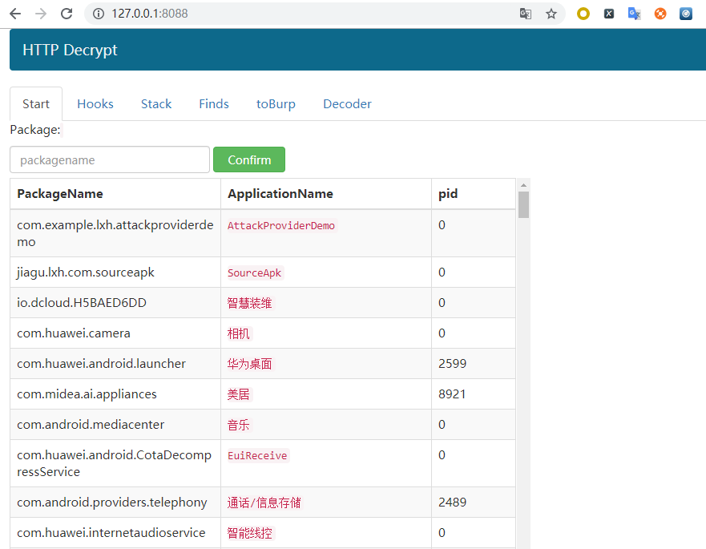

## Installation

Android设备需要root.

确保安装python3并配置环境变量

1. **安装依赖库**
`pip3 install colorlog flask flask_socketio requests`
2. 根据手机架构选择frida [frida-server-version-android-arch.xz](https://github.com/frida/frida/releases) 
3. 解压缩frida-xxx.xz并使用[adb](https://developer.android.com/studio/releases/platform-tools)上传到/data/local/tmp
`adb push frida-server-12.5.0-android-arm /data/local/tmp`
4. 给权限给 frida-server，并运行。
```
adb shell
su root
cd /data/local/tmp
chmod 777 frida-server-12.5.0-android-arm
./frida-server-12.5.0-android-arm
```
5. run app.py，浏览器访问 http://127.0.0.1:8088/ .
`python3 app.py`
6. 你将看下如下界面.


Note:**如果起始页面上没有数据，请尝试刷新页面或 填写任何PackageName并单击"Confirm"**