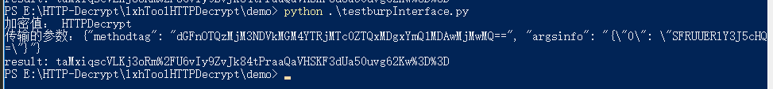

## 对接HTTP Decrypt流量，插件编写。

### 背景；
自带的Burp插件仅支持整个Body数据包的自动化加解密，如果数据包解密之后里面有做数字签名或者数据包加密方式不是整个Body加密的， 而是JSON格式，ex.{"1":"加密值"}，那么这些时候自动加解密就不能使用了，需要自己写Burp插件对接HTTPDecrypt的流量，实现自动化流程。

### 接口描述
HTTPDecrypt专门为编写Burp插件提供了一个接口，
默认接口地址为：
```
http://127.0.0.1:8088/bcall
```
请求方法为：`POST`
参数有两个，一个是methodtag，代表你想使用的方法，这个值在导出函数时，可以从Python Console获得。
另一个argsinfo，代表方法的参数。一个字符串类型的类JSON格式 值。

接口返回的数据包就是该方法执行后的返回值。


例如：
加密方法：`public static java.lang.String com.one.sdk.e.b.a(java.lang.String)`

导出的methodtag是：`tag94323745d0c8a4c174e41081bd50002301`
只有一个参数，因此argsinfo = `{"0":"想要加密的值"}`。

如果方法有多个参数，继续增加字典的键即可。
例如argsinfo = `{"0":"第一个参数的值"，"1":"第二个参数的值","n":"第n+1个参数的值"}`，

**需要注意，字典的值顺序，需要与函数的形参顺序一一对应。**

例如：
方法`a(int,String)`

参数正确应该是 `{"0":666,"1":"String"}`
不要写反成 `{"0":"String","1":6666}`.

### Python实例

以下是python对接HTTPDecrypt接口的例子。
涉及到网络传输，值需要经过Base64编码一次。
``` python
# coding:utf-8
import requests
import base64
import json

def main():
    url = "http://127.0.0.1:8088/bcall"
    methodtag = "tag94323745d0c8a4c174e41081bd50002301"
    valuse = 'HTTPDecrypt'
    print("加密值： {}".format(valuse))
    argsinfo = base64.b64encode(valuse.encode("utf-8")).decode("utf-8")
    argsinfo = json.dumps({"0":argsinfo})

    data = {"methodtag":base64.b64encode(methodtag.encode("utf-8")).decode("utf-8"),"argsinfo":argsinfo}
    print("传输的参数：{}".format(json.dumps(data)))
    result = requests.post(url=url,data=data)
    print("result: {}".format(result.text))

if __name__ == '__main__':
    main()
```
结果如下：


### Java
Java对接， 参考提供的Burp插件代码。


