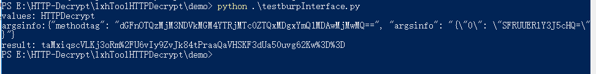

## HTTPDecrypt interface.


url:
```
http://127.0.0.1:8088/bcall
```
method：`POST`

There are two parameters. One is `"methodtag"`, which represents the method you want to use, which you can get from the "Python console" when "toBurp export", and the other is `"argsinfo"`, which represents the parameter value you passed to the method.

The packet returned by the interface is the return value of the method after execution.


ex：
encrypt method：`public static java.lang.String com.one.sdk.e.b.a(java.lang.String)`

export methodtag ：`tag94323745d0c8a4c174e41081bd50002301`

### Python

Parameter values need to be Base64 encoded once.
``` python
# coding:utf-8
import requests
import base64
import json

def main():
    url = "http://127.0.0.1:8088/bcall"
    methodtag = "tag94323745d0c8a4c174e41081bd50002301"
    valuse = 'HTTPDecrypt'
    print("values: {}".format(valuse))
    argsinfo = base64.b64encode(valuse.encode("utf-8")).decode("utf-8")
    argsinfo = json.dumps({"0":argsinfo})

    data = {"methodtag":base64.b64encode(methodtag.encode("utf-8")).decode("utf-8"),"argsinfo":argsinfo}
    print("argsinfo:{}".format(json.dumps(data)))
    result = requests.post(url=url,data=data)
    print("result: {}".format(result.text))

if __name__ == '__main__':
    main()
```
结果如下：



If the method has multiple arguments, keep adding dictionary keys.
ex:
argsinfo = `{"0":"The value of the first argument"，"1":"The value of the two argument","n":"The value of the n+1 argument"}`，


**Notice that the order of the values in the dictionary needs to correspond to the order of the formal parameters of the function.**
ex：
method : `a(int,String)`

The parameter should be correct -> `{"0":666,"1":"String"}`
incorrect -> `{"0":"String","1":6666}`.

### Java
refer to the provided Burp plug-in code.


