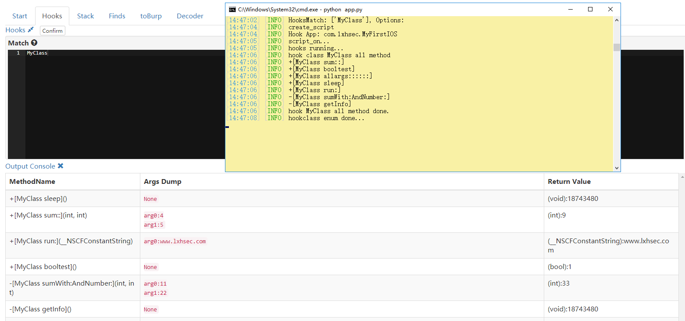
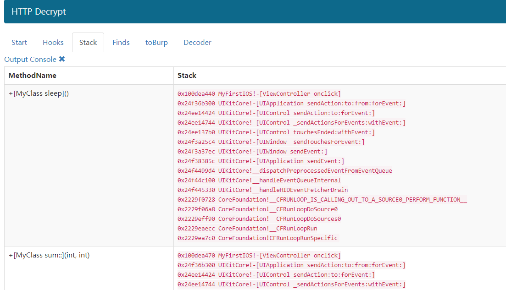
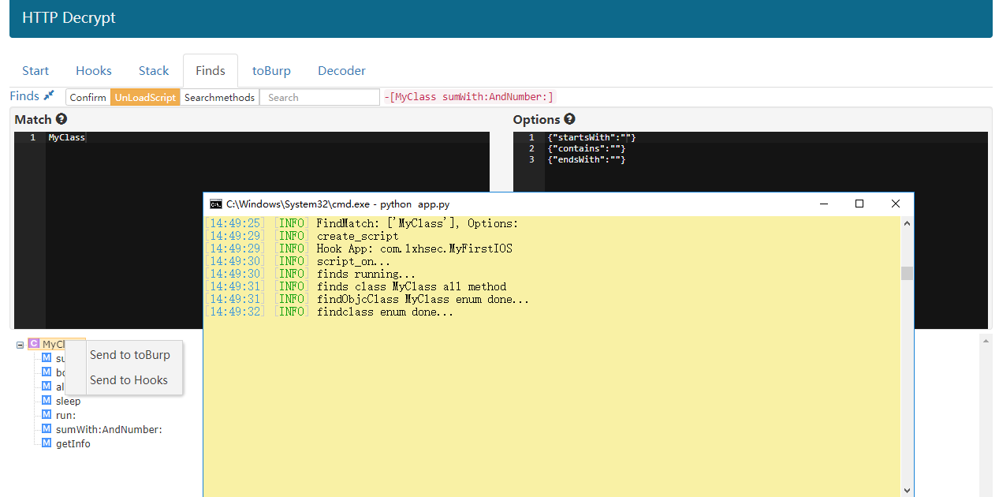
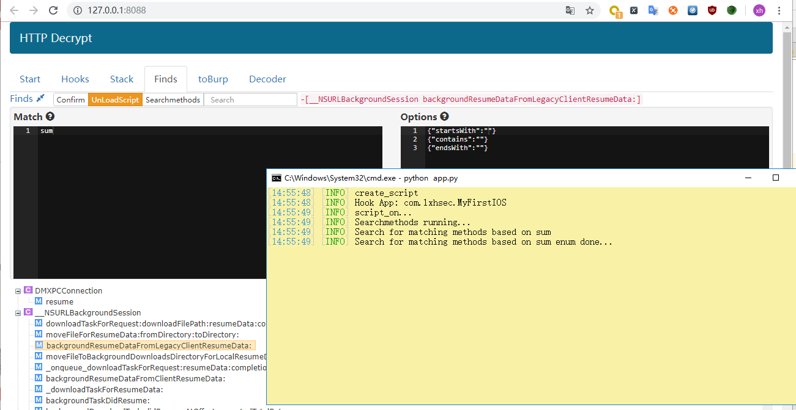
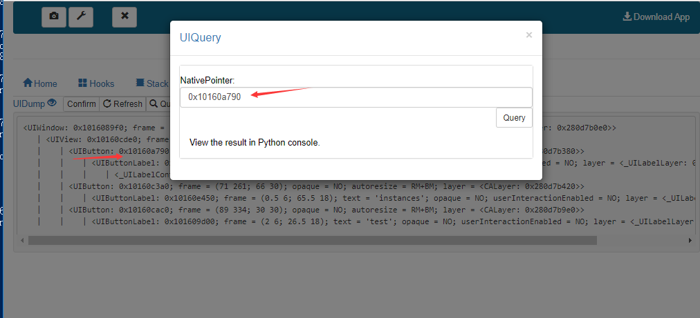
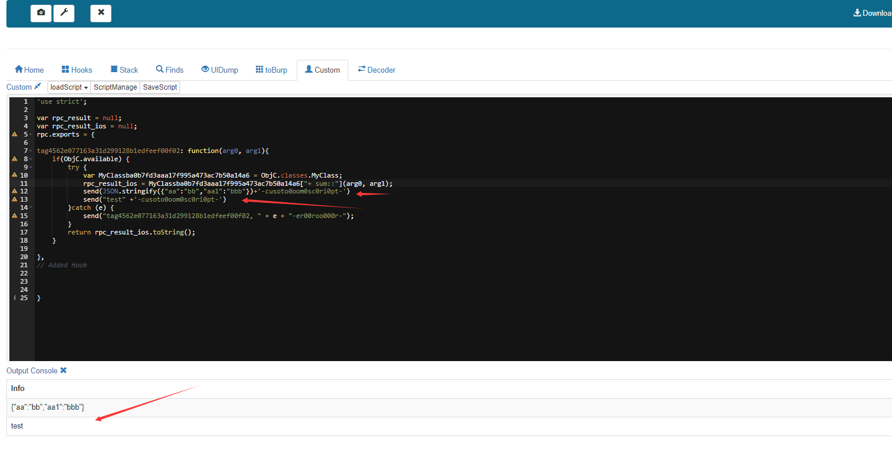
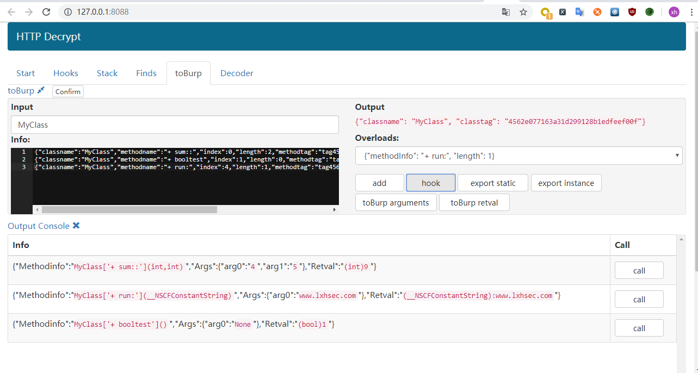

### Hooks

### Stack

### Finds

## Searchmethods

## UIDump

## Custom

### toBurp

### toBurp-toBurp
Only three types of modification and replacement of int, Bool, and NSString* are supported.

