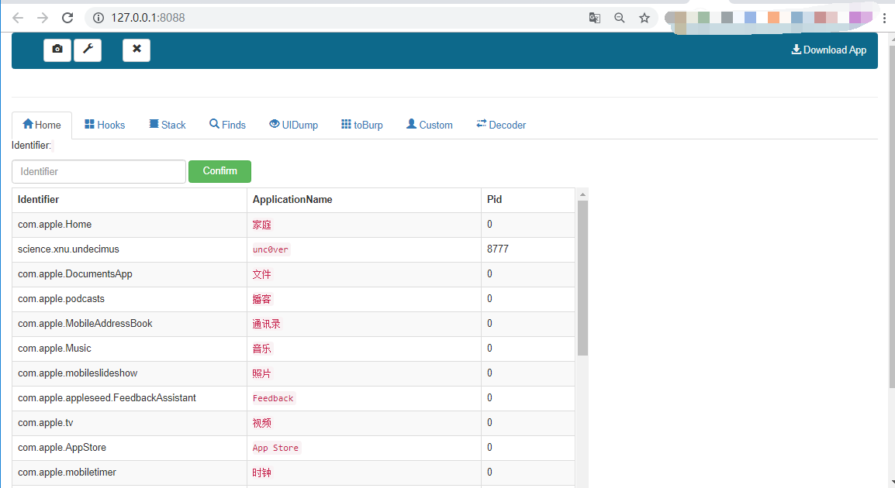

## Installation

IOS Device requires jailbroken.

Make sure to install python and configure environment variables

1. **Install dependency libraries**
`pip3 install colorlog flask flask_socketio requests frida-tools`
2. Install frida-server
Start Cydia and add Frida’s repository `https://build.frida.re` , find and install the Frida package
3. Install the same version of the python library as frida-server
```
pip3 install frida==12.5.0
```
4. run app.py，Browser access to http://127.0.0.1:8088/ .
`python3 app.py`
5. You will see the following page.


Note:**If there is no data on the start page, try refreshing the page or filling in any PackageName and clicking on Confirm**

PPS: to use under Windows, iTunes must be installed.