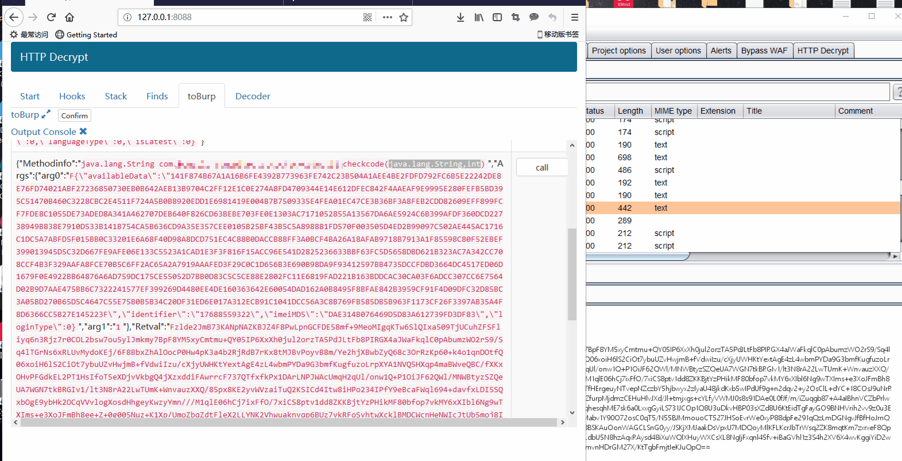

### Hooks
填写的字符串，会与所有已加载的类名进行匹配，如果匹配上了则hook该类下的所有方法。多个类名，换行填写,增加过滤方法功能，右边填写需要过滤的方法名字。

### Stack
Hooks打印的堆栈会在这里显示。

### Finds
填写的字符串，会与所有已加载的类名进行匹配，如果匹配上了则打印该类下的所有方法，为空则将已经加载了的所有类打印出来。
提供了过滤类功能，填写需要过滤的类名称 或者类名称的一部分。

## Searchmethods
根据填写的字符串搜索匹配的方法，支持正则。

### toBurp
功能使用与Andriod相同。

### toBurp-toBurp
拦截指定函数，修改参数or返回值，再返回给应用程序。

由于IOS 完全兼容C，参数类型不好适配，目前仅支持 int，Bool, NSString* 这三种类型的修改与替换，其余类型程序直接跳过，即使修改了也不会生效。

## Decoder
新增Decoder功能，支持byte[] 与字符串相互转换，byte[] 与十六进制字符串相互转换。
在Hooks的时候，会打印byte[]参数，如果我们想看byte参数的字符串内容，或者看AES/DES等加密算法的Key(Key与iV都是以数组形式打印出来，将其转换成16进制字符串就是代码中填写的值)，就可以使用这个功能。

Note：如果转换后是乱码，一般都是加密算法(AES等)加密之后的结果。

## New
多参数函数加解密。
下面实例中，加密函数是多个参数的 第二个参数的值为1.因此字典构造为：

{"0":"019CE961992BA5AB","1":1}
019CE961992BA5AB是个Tag，标记着选中的数据。

效果:

